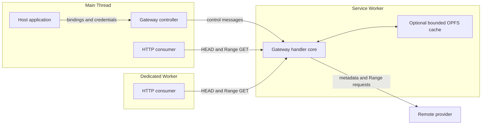

# Browser Remote File Gateway

`RemoteFileGateway` publishes immutable, same-origin HTTP resources backed by remote providers.

The standalone module Service Worker owns lifecycle listeners and dispatches fetch and message events to the listener-free `createRemoteFileGatewayHandler()` core.



Virtual resources use `/remote-file-gateway/objects/<immutable-object-id>` without a file-format suffix. Consumers use `HEAD` or single-range `GET`; provider locators and credentials are not part of the virtual URI.

The Gateway does not create consumer Workers, depend on DuckDB, parse file formats, or publish Catalog metadata. `mimeType` only determines the HTTP `Content-Type` header.

## HTTP contract

`HEAD` returns the full object size with `200`, or selected range metadata with `206` when a valid single byte range is supplied.

`GET` requires a bounded or open-ended single byte range and returns `206` without buffering a large remote response in full. Non-range `GET` returns `400`, unsupported methods return `405`, and invalid, suffix, or multiple ranges return `416`.

Every non-2xx response generated by the Gateway includes a machine-readable code in `X-Remote-File-Gateway-Error-Code`.

Requests outside the configured virtual base and messages outside the Gateway namespace are not claimed, so a host Service Worker can handle them.

## Service Worker modes

Standalone mode registers the supplied Service Worker as a module and waits for it to control the page before negotiating protocol version 1, the configured virtual base, and required capabilities:

```js
const gateway = await RemoteFileGateway.register({
  serviceWorkerUrl: '/remote-file-gateway/service-worker.js',
  scope: '/',
  virtualBase: '/remote-file-gateway/',
})
```

Integrated mode connects to an existing module Service Worker registration. The host imports `createRemoteFileGatewayHandler()`, dispatches matching fetch and message events to it, and retains ownership of install, activation, and unrelated event handling.

```js
const gateway = await RemoteFileGateway.connect({
  registration,
  virtualBase: '/remote-file-gateway/',
})
```

The host module Service Worker dispatches to the listener-free core before its own fallback handlers:

```js
import { createRemoteFileGatewayHandler } from './service-worker-handler.js'

const gateway = createRemoteFileGatewayHandler({
  virtualBase: '/remote-file-gateway/',
})

self.addEventListener('fetch', (event) => {
  if (gateway.handleFetch(event)) return
  // Host fetch handlers continue here.
})

self.addEventListener('message', (event) => {
  if (gateway.handleMessage(event)) return
  // Host message handlers continue here.
})
```

The core does not register global listeners or call `skipWaiting()` or `clients.claim()`. The host owns those lifecycle decisions in Integrated mode.

A `controllerchange` invalidates the negotiated connection. The next control-plane operation verifies the registration binding and repeats the handshake.

## Binding, credentials, and identity

Provider bindings are persisted in IndexedDB, while credentials remain only in Service Worker RAM.

Credentials are shared by clients using the same Gateway-enabled Service Worker registration. Calling `close()` releases one controller instance without changing shared credentials; the host calls `clearCredential(provider)` explicitly during logout.

An object ID permanently identifies its provider, byte length, content version, and provider object identity. An HTTP locator can rotate without changing the virtual URI; changed bytes require a new object ID and URI.

## Providers

Current bindings:

| Provider | Status | Notes |
| --- | --- | --- |
| Google Drive | Supported | credential stays in Service Worker RAM |
| HTTP Range | Supported | upstream must honor byte ranges |

The provider interface is independent of DuckDB and file formats.

## Optional OPFS cache

The optional OPFS cache stores only objects at or below `maxFullObjectCacheBytes`. Cache hits read the requested `File.slice()` only; larger objects bypass OPFS and continue using remote Range requests.

The default threshold is zero, so the host must opt into a product-specific bound.

## Public API

```js
import {
  RemoteFileGateway,
  RemoteFileGatewayError,
} from './src/controller.mjs'

import { createRemoteFileGatewayHandler } from './src/service-worker-handler.js'
```

## Development

```sh
npm install
npm test
npm run test:browser
```

CI runs the generic HTTP contract in Chromium, Firefox, and WebKit without DuckDB.

## Status

Experimental. The public API is still evolving.

## License

MIT
