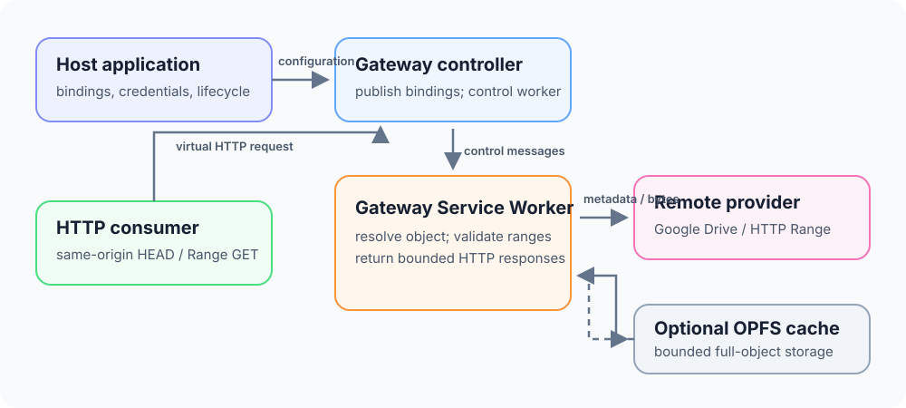

# Concepts

The Gateway adapts a provider object into a same-origin HTTP resource. The host application decides which immutable object to publish and how to obtain credentials. The page-side controller sends binding and credential updates to the Service Worker; consumers request byte ranges from that worker through the virtual URI.



## Responsibilities

The Gateway owns binding persistence, provider requests, byte-range validation, optional OPFS caching, and the virtual HTTP response. It does not create application workers, understand file formats, or manage application-level catalog metadata. A consumer can be any same-origin code that can issue `HEAD` or `Range` `GET` requests.

`mimeType` is used for the response `Content-Type`; it does not enable parsing. The object URI has no extension and does not expose the provider locator:

```text
https://app.example/remote-file-gateway/objects/events-v1
```

## Service Worker modes

In standalone mode, `RemoteFileGateway.register()` registers the supplied module Service Worker. That entrypoint attaches lifecycle, fetch, and message listeners and configures the virtual base. This is the shortest path for an application without an existing Service Worker.

In integrated mode, the host imports `createRemoteFileGatewayHandler()` into its own module Service Worker and calls `handleFetch()` and `handleMessage()`. The handler claims only its own virtual paths and message namespace; unrelated events remain available to the host. It never registers global listeners or decides when to activate or claim clients.

`RemoteFileGateway.connect()` connects the page-side controller to an existing registration. The controller verifies that the active worker controls the page and negotiates protocol version 1 and required capabilities. When control changes, it repeats that handshake before the next control-plane operation.

## Bindings and revisions

`publishBindings(revision, bindings)` atomically replaces the active binding set in IndexedDB. Revisions are `bigint` values in the unsigned 64-bit range. A lower revision is stale; reusing the current revision is allowed only when the binding content is identical.

An object ID is permanent identity. Its provider, byte length, content version, and provider object identity must stay fixed. A locator can rotate while the identity stays the same, which lets an application update a signed HTTP URL without changing the consumer-facing URI. If the bytes change, publish the new bytes under a new object ID.

Bindings persist across Service Worker restarts. Google Drive access tokens do not: credentials are held only in Service Worker memory. Clients using the same Gateway-enabled registration share that in-memory credential state.

## Lifecycle and routing

The Gateway claims same-origin requests whose path exactly matches `/remote-file-gateway/objects/<object-id>` under the configured virtual base. Other fetches and messages are left to the host Service Worker. In integrated mode, call `handleFetch()` and `handleMessage()` synchronously from the corresponding event listeners so the handler can call `respondWith()` or retain work with `waitUntil()`.

The standalone Service Worker currently calls `skipWaiting()` and `clients.claim()` to take control. An integrated host should make those lifecycle decisions for its own application. `close()` releases only a page-side controller instance; it does not unregister the worker, remove bindings, or clear shared credentials.

See [Quickstart](./getting-started.md), [Providers](./providers.md), and [API and HTTP reference](./reference.md) for setup and exact request details.
