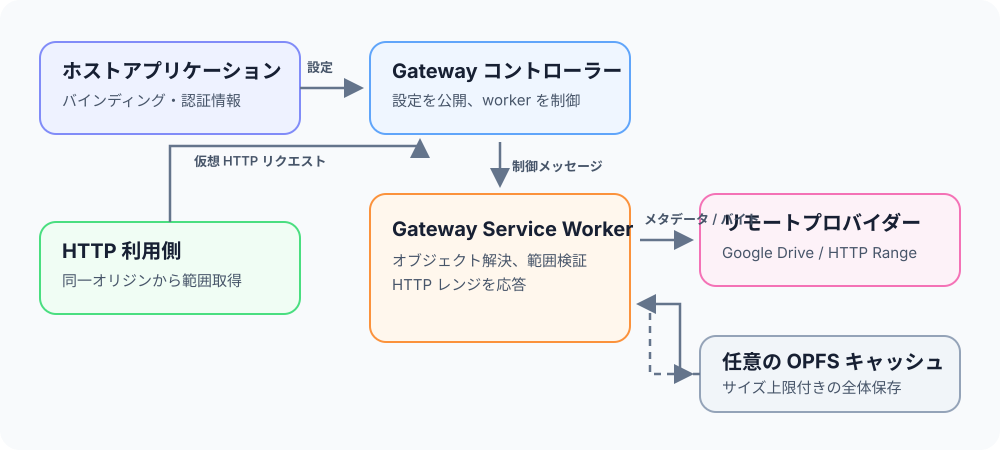

# 基本概念

Gateway は、プロバイダーのオブジェクトを同一オリジンの HTTP リソースに変換します。公開する不変オブジェクトと認証情報はホストアプリケーションが選びます。ページ側コントローラーはバインディングや認証情報の更新を Service Worker に送り、利用側は仮想 URI を通じてその worker に範囲リクエストを送ります。



## 責務

Gateway はバインディングの永続化、プロバイダーへのリクエスト、バイト範囲の検証、任意の OPFS キャッシュ、仮想 HTTP レスポンスを担当します。アプリケーション Worker の作成、ファイル形式の解析、カタログメタデータの管理は行いません。利用側は、`HEAD` または `Range` 付き `GET` を送れる同一オリジンの任意のコードです。

`mimeType` はレスポンスの `Content-Type` に使われますが、ファイル解析を有効にするものではありません。オブジェクト URI に拡張子やプロバイダーの URL は含まれません。

```text
https://app.example/remote-file-gateway/objects/events-v1
```

## Service Worker のモード

単独モードでは、`RemoteFileGateway.register()` が指定された module Service Worker を登録します。そのエントリーポイントがライフサイクル、fetch、message の各リスナーを設定し、仮想パスの基底も構成します。既存 Service Worker がないアプリケーションに適した最短の構成です。

統合モードでは、ホストが `createRemoteFileGatewayHandler()` を自身の module Service Worker に読み込み、`handleFetch()` と `handleMessage()` を呼び出します。ハンドラーは専用の仮想パスとメッセージ名前空間だけを処理し、それ以外のイベントはホストに委ねます。グローバルリスナーを登録せず、アクティベーションやクライアントの制御も決めません。

`RemoteFileGateway.connect()` はページ側コントローラーを既存登録に接続します。コントローラーはアクティブな Service Worker がページを制御しているか確認し、プロトコルバージョン 1 と必須機能をネゴシエートします。制御対象が変わると、次回の制御操作の前に再度ハンドシェイクします。

## バインディングとリビジョン

`publishBindings(revision, bindings)` は IndexedDB の有効なバインディング一式をアトミックに置き換えます。リビジョンは符号なし 64 ビット範囲の `bigint` です。小さいリビジョンは古い値として拒否されます。同じリビジョンを再利用できるのは、内容が同一の場合だけです。

オブジェクト ID は固定の識別子です。プロバイダー、バイト長、コンテンツバージョン、プロバイダー側のオブジェクト ID を変更してはいけません。HTTP のロケーターは、同じ識別子のまま更新できます。たとえば署名付き URL を更新しても、利用側の URI は変わりません。内容が変わる場合は新しいオブジェクト ID を使用してください。

バインディングは Service Worker の再起動後も IndexedDB に残ります。Google Drive のアクセストークンは永続化されず、Service Worker のメモリ内だけに保持されます。同じ Gateway 登録を使うクライアントは、その認証情報を共有します。

## ライフサイクルとルーティング

Gateway は、設定された仮想ベースの下にある `/remote-file-gateway/objects/<object-id>` 形式の同一オリジンリクエストだけを処理します。それ以外の fetch と message はホスト Service Worker に委ねます。統合モードでは、対応するイベントリスナー内で同期的に `handleFetch()` と `handleMessage()` を呼び、ハンドラーが `respondWith()` または `waitUntil()` を設定できるようにします。

単独 Service Worker は現在、制御を取得するため `skipWaiting()` と `clients.claim()` を呼びます。統合モードのホストは、自アプリケーションのライフサイクルに合わせてそれらを管理してください。`close()` が解放するのはページ側のコントローラーインスタンスだけです。Service Worker の登録解除、バインディング削除、共有認証情報の消去は行いません。

設定例とリクエストの詳細は[クイックスタート](./getting-started.md)、[プロバイダー](./providers.md)、[API と HTTP リファレンス](./reference.md)を参照してください。
